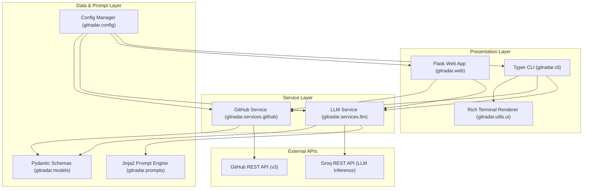
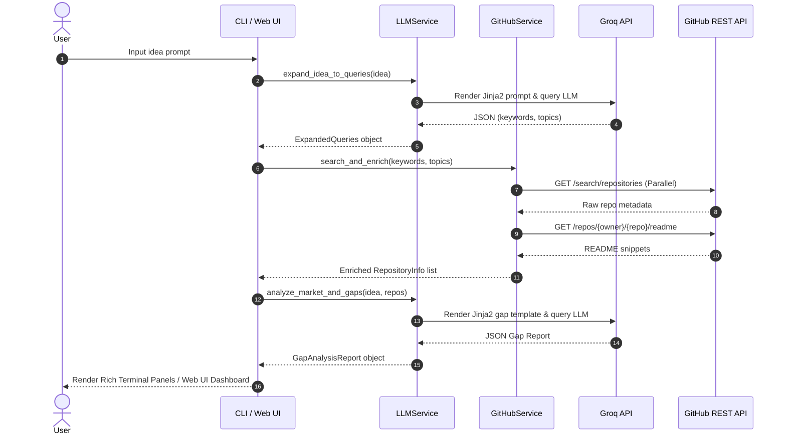

# GitRadar Technical Architecture 🏛️

This document outlines the software architecture, component relationships, data flow pipelines, and resiliency strategies of **GitRadar**.

---

## 📐 High-Level Architectural Pattern

GitRadar adopts a modular, layer-decoupled architecture separating **Presentation** (Terminal CLI & Web UI), **Domain Services** (GitHub REST API & LLM Orchestration), **Prompt Engine** (Jinja2 Templates), and **Persistence** (Pydantic Settings).

---

## 📦 Component Details

### 1. Presentation Layer
- **CLI (`gitradar/cli.py`)**: Built on `typer`. Defines commands (`analyze`, `ui`, `search`, `config`, `version`), manages options/arguments, handles async runtime execution via `asyncio.run()`, and controls terminal status spinners.
- **Web UI (`gitradar/web/`)**: Built on `flask`. Hosts a local single-page web dashboard (`/`), JSON REST endpoints (`/api/analyze`, `/api/search`, `/api/config`), and serves static assets (`style.css` glassmorphism styling, `app.js` AJAX handler).
- **Rich UI (`gitradar/utils/ui.py`)**: Renders stylized terminal banners, query strategy panels, colored repository tables, and Markdown gap report panels.

### 2. Service Layer & Resiliency
- **GitHub Service (`gitradar/services/github.py`)**: Asynchronous HTTP client built with `httpx`. Executes concurrent keyword/topic searches via `asyncio.gather`, deduplicates repositories, handles rate limiting (HTTP 403), and enriches top candidates with README snippets.
- **LLM Service (`gitradar/services/llm.py`)**: Integrates LiteLLM with Groq models. Features:
  - **Dynamic Groq Model Discovery**: Interrogates `https://api.groq.com/openai/v1/models` to discover active text models available for the user's API key.
  - **Fallback Execution**: Automatically tries primary model -> discovered active Groq models -> known fallback models.
  - **Dual Mode JSON Handling**: Tries `response_format={"type": "json_object"}` first; if rejected by provider server-side validation, retries in standard completion mode and parses content using `extract_json()`.
  - **Noise Suppression**: Sets `litellm.suppress_debug_info = True` and `litellm.set_verbose = False` to prevent terminal log pollution.

### 3. Prompt Engine (`gitradar/prompts/`)
- Uses `jinja2.Environment` and `FileSystemLoader`.
- Decouples prompt engineering from Python code.
- Templates:
  - `query_expansion_system.j2` / `query_expansion_user.j2`
  - `gap_analysis_system.j2` / `gap_analysis_user.j2`

---

## 🔄 End-to-End Sequence Flow

---

## 🛡️ Error & Exception Matrix

| Failure Mode | Component | Handling & Fallback Strategy |
| --- | --- | --- |
| Missing `GROQ_API_KEY` | `LLMService` | Raises friendly `ValueError` guiding user to `gitradar config --groq-api-key`. |
| GitHub API Rate Limit (HTTP 403) | `GitHubService` | Catches status code and prompts user to set `GITHUB_TOKEN`. |
| Groq Model Not Found | `LLMService` | Dynamically queries `/v1/models` and falls back to active alternative models. |
| Server-side JSON Validate Failed | `LLMService` | Retries without `response_format` constraint and uses robust `extract_json()` regex parser. |
