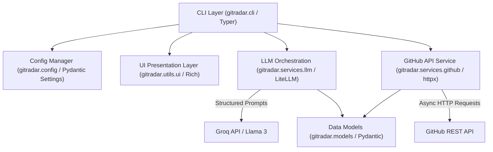
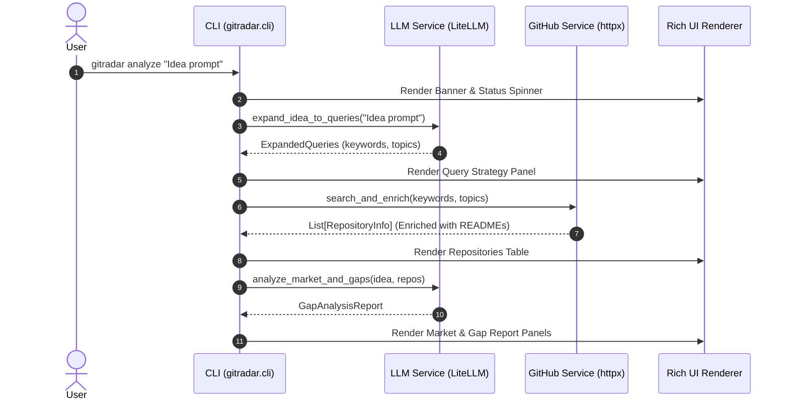

# GitRadar Technical Architecture 🏛️

This document outlines the technical design, component hierarchy, data flow, and design patterns used in **GitRadar**.

---

## 📐 System Architecture Overview

GitRadar follows a modular, layer-decoupled architecture designed for speed, extensibility, and maintainability.

---

## 📦 Component Breakdown

### 1. CLI Layer (`gitradar/cli.py`)
- **Framework**: `typer`
- **Responsibility**: Orchestrates CLI commands (`analyze`, `search`, `config`, `version`). Captures user inputs, triggers async event loops, coordinates service calls, and manages application status spinners.

### 2. Configuration & Settings (`gitradar/config.py`)
- **Framework**: `pydantic-settings`, `python-dotenv`
- **Responsibility**: Manages environment variables and persistent configuration files (`~/.config/gitradar/config.env`). Automatically masks sensitive credentials when rendered in the terminal.

### 3. GitHub API Service (`gitradar/services/github.py`)
- **Framework**: `httpx` (async)
- **Responsibility**: Interacts with the GitHub REST API (`/search/repositories`, `/repos/{owner}/{repo}/readme`).
- **Features**:
  - Asynchronous parallel search queries (`asyncio.gather`).
  - Rate limit detection (HTTP status 403 handling).
  - Enrichment of top candidate repositories with README text snippets.

### 4. LLM Orchestration Service (`gitradar/services/llm.py`)
- **Framework**: `litellm`
- **Default Provider**: Groq (`groq/llama-3.3-70b-versatile`)
- **Responsibility**:
  - **Task 1 (Query Expansion)**: Converts raw user prompts into structured JSON objects containing search keywords, GitHub topic tags, and programming language targets.
  - **Task 2 (Semantic Analysis)**: Receives enriched repository summaries and generates structured `GapAnalysisReport` objects (market saturation index, top competitors, unmet needs, differentiators, recommendations).

### 5. UI Presentation Layer (`gitradar/utils/ui.py`)
- **Framework**: `rich`
- **Responsibility**: Formats tables, panels, progress indicators, status spinners, markdown blocks, and warning callouts.

---

## 🔄 Sequence Flow (`gitradar analyze`)

---

## 🛡️ Error Handling & Resiliency

1. **Missing API Keys**: If `GROQ_API_KEY` is not found, the LLM service raises a `ValueError` caught by the CLI, presenting a actionable `gitradar config --groq-api-key` instruction.
2. **GitHub Rate Limits**: Without a `GITHUB_TOKEN`, unauthenticated GitHub searches are capped at 60 requests/hour. HTTP 403 responses trigger a helpful prompt advising the user to add a GitHub token.
3. **LLM Output Validation**: Structured responses use `response_format={"type": "json_object"}` and are validated against Pydantic schema models to prevent parsing exceptions.
