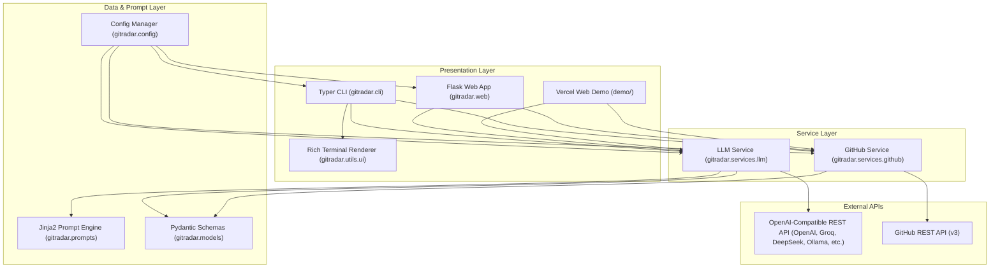
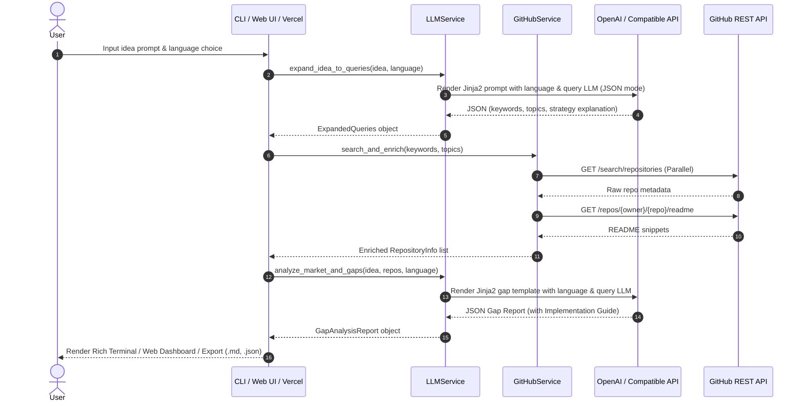

# GitRadar Technical Architecture 🏛️

This document outlines the software architecture, component relationships, data flow pipelines, and resiliency strategies of **GitRadar**.

---

## 📐 High-Level Architectural Pattern

GitRadar adopts a modular, layer-decoupled architecture separating **Presentation** (Terminal CLI, Local Web UI, & Vercel Serverless Demo), **Domain Services** (GitHub REST API & LLM Orchestration), **Prompt Engine** (Jinja2 Templates), and **Persistence** (Pydantic Settings & LocalStorage).

---

## 📦 Component Details

### 1. Presentation Layer
- **CLI (`gitradar/cli.py`)**: Built on `typer`. Defines commands (`analyze`, `ui`, `search`, `config`, `version`), manages options/arguments (including `--lang`, `--api-key`, `--base-url`, `--model`), handles async runtime execution via `asyncio.run()`, and controls terminal status spinners.
- **Local Web UI (`gitradar/web/`)**: Built on `flask`. Hosts a single-page web dashboard (`/`), JSON REST endpoints (`/api/analyze`, `/api/search`, `/api/config`), serves static assets, and supports full report exporting (`.md`, `.json`, clipboard).
- **Vercel Web Demo (`demo/`)**: Standalone, Vercel-ready serverless environment (`demo/api/index.py` & `@vercel/python`). Accepts user-provided OpenAI/Groq API keys (`X-OpenAI-Api-Key`, `X-Groq-Api-Key`), custom base URLs (`X-OpenAI-Base-Url`), and GitHub Access Tokens (`X-Github-Token`) via HTTPS headers for zero-server-state hosting.
- **Rich UI (`gitradar/utils/ui.py`)**: Renders stylized terminal banners, query strategy panels, repository tables, gap report panels, and technical implementation roadmaps.

### 2. Service Layer & Resiliency
- **GitHub Service (`gitradar/services/github.py`)**: Asynchronous HTTP client built with `httpx`. Executes concurrent keyword/topic searches via `asyncio.gather`, deduplicates repositories, handles rate limiting (HTTP 403), and enriches top candidates with README snippets. Accepts per-request user GitHub tokens.
- **LLM Service (`gitradar/services/llm.py`)**: Direct OpenAI-compatible standard integration (`openai.OpenAI`). Features:
  - **Universal Connection Schema**: Connects via `api_key`, `base_url`, and `model` to any OpenAI-compliant provider (OpenAI, Groq, DeepSeek, OpenRouter, Ollama, vLLM).
  - **Automatic Groq Detection**: If `gsk_...` key is provided or `GROQ_API_KEY` is present, automatically configures `base_url="https://api.groq.com/openai/v1"` and defaults to `llama-3.3-70b-versatile` for 100% backward compatibility.
  - **Dynamic Model Discovery**: Interrogates `client.models.list()` to discover available models.
  - **Fallback Execution**: Automatically tries primary model -> fallback models.
  - **Dual Mode JSON Handling**: Tries `response_format={"type": "json_object"}` first; if rejected by provider server-side validation, retries in standard completion mode and parses content using `extract_json()`.

### 3. Data Models (`gitradar/models.py`)
- **`RepositoryInfo`**: Summary schema for GitHub repositories.
- **`ExpandedQueries`**: LLM-derived search strategy.
- **`CompetitorSummary`**: Competitor strengths and gap profiles.
- **`OpenSourceTool`**: Recommended open-source library/tool (`name`, `category`, `description_and_usage`, `repo_url`).
- **`ImplementationGuide`**: Architecture overview, recommended tech stack, and open-source building blocks.
- **`GapAnalysisReport`**: Full executive gap report schema containing market saturation, opportunity score, unmet needs, differentiators, recommendations, and implementation roadmap.

### 4. Prompt Engine (`gitradar/prompts/`)
- Uses `jinja2.Environment` and `FileSystemLoader`.
- Decouples prompt engineering from Python code.
- Templates:
  - `query_expansion_system.j2` / `query_expansion_user.j2`
  - `gap_analysis_system.j2` / `gap_analysis_user.j2`

---

## 🔄 End-to-End Sequence Flow

---

## 🛡️ Error & Exception Matrix

| Failure Mode | Component | Handling & Fallback Strategy |
| --- | --- | --- |
| Missing AI API Key | `LLMService` | Friendly `ValueError` guiding user to `gitradar config --openai-api-key` or browser Settings modal. |
| Authentication Error | `LLMService` | Catches `AuthenticationError` and prompts user with clear provider and key guidance. |
| GitHub API Rate Limit (HTTP 403) | `GitHubService` | Catches status code and prompts user to set `GITHUB_TOKEN`. |
| Server-side JSON Validate Failed | `LLMService` | Retries without `response_format` constraint and uses robust `extract_json()` regex parser. |

