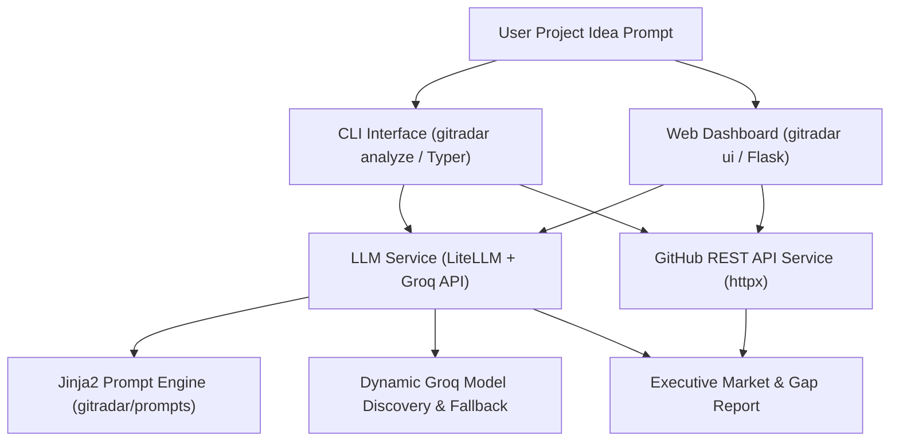

# 📡 GitRadar

<p align="center">
  
</p>

<p align="center">
  <b>Smart GitHub Market & Gap Analysis Tool Driven by AI & GitHub REST API</b><br>
  <i>Validate your developer project ideas in seconds — via Rich Terminal CLI or Interactive Web Dashboard.</i>
</p>

<p align="center">
  <a href="https://github.com/username/GitRadar/actions"></a>
  <a href="https://pypi.org/project/gitradar/"></a>
  <a href="https://pypi.org/project/gitradar/"></a>
  <a href="./LICENSE"></a>
  <a href="https://github.com/psf/black"></a>
</p>

---

## 💡 What is GitRadar?

**GitRadar** is an open-source tool designed for developers, open-source creators, and tech founders to perform instant **Market & Gap Analysis** on software project ideas.

Before writing code for a new side project or open-source tool, GitRadar helps you answer critical questions:
- *What open-source repositories already exist for this concept?*
- *What features or capabilities are current repos missing (unmet market needs)?*
- *What unique differentiators will make your project stand out?*

GitRadar expands your raw idea into intelligent GitHub queries, fetches candidate repositories via the GitHub REST API, semantically analyzes competitors using **LiteLLM** & **Groq** (with automatic model discovery), and renders an executive report in your terminal or inside a local **Web Dashboard**.

---

## ✨ Key Features

- 🧠 **AI Query Expansion**: Translates raw developer ideas into optimized search keywords, language filters, and GitHub topic tags (`#cli`, `#ai`, `#devtools`).
- ⚡ **Async GitHub Repository Scanner**: Concurrently fetches metadata, star/fork counts, topic tags, and README snippets via `httpx`.
- 🎯 **Semantic Gap Analysis**: Synthesizes market saturation levels, top competitor strengths/weaknesses, ecosystem gaps, and strategic recommendations.
- 🌐 **Interactive Web Dashboard (`gitradar ui`)**: Built with Flask, featuring a glassmorphic dark theme, AJAX search, live progress indicators, and visual metric gauges.
- 🎨 **Rich Terminal UX**: Beautiful CLI output with color-coded status badges, formatted tables, Markdown panels, and suppressed debug log noise.
- 📄 **Jinja2 Prompt Engine**: All LLM prompts are stored as decoupled `.j2` templates in `gitradar/prompts/` for easy customization.
- 🔄 **Dynamic Model Discovery**: Queries Groq API model endpoints dynamically to select active models (`groq/openai/gpt-oss-120b`, `groq/qwen/qwen3.6-27b`, `groq/llama-3.1-8b-instant`) with automatic fallback resiliency.

---

## 🛠️ Architecture Overview



---

## 🚀 Quick Start

### Installation

Install GitRadar from PyPI or locally:

```bash
pip install gitradar
```

Or install from source in editable mode:

```bash
git clone https://github.com/username/GitRadar.git
cd GitRadar
pip install -e ".[dev]"
```

---

## 🔑 Configuration

GitRadar uses **Groq** for ultra-fast LLM inference.

1. **Set your Groq API Key**:
   ```bash
   gitradar config --groq-api-key "gsk_your_groq_api_key_here"
   ```

2. *(Optional)* **Set a GitHub Token** to boost API rate limits (from 60 to 5,000 requests/hour):
   ```bash
   gitradar config --github-token "ghp_your_github_token_here"
   ```

3. **Inspect Active Settings**:
   ```bash
   gitradar config --show
   ```

---

## 💻 CLI Commands & Usage

### 💡 1. `gitradar analyze <IDEA>`

Executes the full end-to-end AI market and gap analysis workflow in the terminal:

```bash
gitradar analyze "AI powered code review tool for terminal and git hooks"
```

**Options:**
- `--limit` / `-l`: Maximum repositories to evaluate (Default: `10`)
- `--model` / `-m`: Override LLM model (e.g. `groq/openai/gpt-oss-120b`, `groq/qwen/qwen3.6-27b`)

---

### 🌐 2. `gitradar ui`

Launches the local interactive web dashboard in your default browser:

```bash
gitradar ui --port 5000
```

**Options:**
- `--port` / `-p`: Web server port (Default: `5000`)
- `--host` / `-h`: Binding host address (Default: `127.0.0.1`)
- `--open / --no-open`: Automatically open browser tab (Default: `--open`)

---

### 🔍 3. `gitradar search <QUERY>`

Performs a fast, direct GitHub repository search without LLM synthesis:

```bash
gitradar search "terminal devtools" --limit 5 --sort stars
```

---

### ⚙️ 4. `gitradar config`

View or update credentials and preferences:

```bash
gitradar config --show
```

---

### ℹ️ 5. `gitradar version`

Displays version information:

```bash
gitradar version
```

---

## 🐍 Python SDK Usage

You can import GitRadar services directly in custom Python scripts:

```python
import asyncio
from gitradar.services.github import GitHubService
from gitradar.services.llm import LLMService

async def main():
    idea = "AI automated documentation generator"
    
    github_service = GitHubService()
    llm_service = LLMService()

    # 1. Expand idea into search keywords
    queries = llm_service.expand_idea_to_queries(idea)

    # 2. Fetch candidate repos
    repos = await github_service.search_and_enrich(
        keywords=queries.search_keywords,
        topics=queries.github_topics,
        limit=5,
    )

    # 3. Synthesize Market & Gap Report
    report = llm_service.analyze_market_and_gaps(idea, repos)
    print("Market Saturation:", report.market_saturation)
    print("Opportunity Score:", report.opportunity_score)

asyncio.run(main())
```

---

## 🧪 Testing

GitRadar uses `pytest` for unit and integration testing:

```bash
pytest
```

---

## 📚 Documentation Index

- [ARCHITECTURE.md](./ARCHITECTURE.md): Deep-dive into technical design, dynamic model resolution, and Jinja2 prompt engine.
- [CONTRIBUTING.md](./CONTRIBUTING.md): Guidelines for submitting PRs, coding standards, and conventional commits.
- [SECURITY.md](./SECURITY.md): Security policy and vulnerability disclosure procedures.
- [CHANGELOG.md](./CHANGELOG.md): Semantic release history.
- [examples/README.md](./examples/README.md): Sample scripts and JSON report schemas.

---

## 📄 License

GitRadar is open-source software licensed under the [MIT License](./LICENSE).
