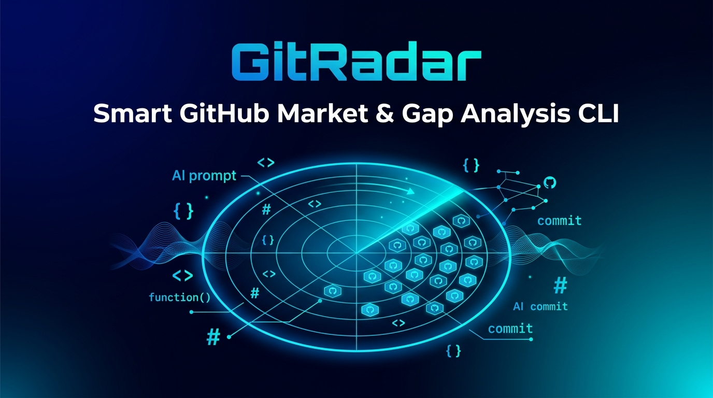

# 📡 GitRadar

<p align="center">
  
</p>

<p align="center">
  <b>Smart GitHub Market & Gap Analysis Tool Driven by AI & GitHub REST API</b><br>
  <i>Validate your developer project ideas in seconds — via Rich Terminal CLI, Interactive Web Dashboard, or 1-Click Vercel Web Demo.</i>
</p>

<p align="center">
  <a href="https://github.com/AtaCanYmc/GitRadar/actions"></a>
  <a href="https://pypi.org/project/gitradar/"></a>
  <a href="https://pypi.org/project/gitradar/"></a>
  <a href="./LICENSE"></a>
  <a href="https://vercel.com/new/clone?repository-url=https%3A%2F%2Fgithub.com%2FAtaCanYmc%2FGitRadar&root-directory=demo"></a>
</p>

---

## 💡 What is GitRadar?

**GitRadar** is an open-source AI developer tool designed for developers, creators, and founders to perform instant **Market & Gap Analysis** on software project concepts.

Before spending weeks building a new side project or open-source tool, GitRadar helps you answer critical questions:
- *What open-source repositories already exist for this concept on GitHub?*
- *What capabilities are existing repos missing (unmet market needs)?*
- *What unique differentiators will make your project stand out?*
- *How should you architect the software, what technology stack to choose, and what open-source building blocks can you leverage?*

GitRadar expands your raw idea into intelligent GitHub queries, fetches candidate repositories via the GitHub REST API, semantically analyzes competitors using **LiteLLM** & **Groq** (with automatic model discovery), and renders an executive report in your terminal, local **Web Dashboard**, or hosted **Vercel Web Demo**.

---

## ✨ Key Features

- 🧠 **AI Query Expansion**: Translates raw developer ideas into optimized search keywords, language filters, and GitHub topic tags (`#cli`, `#ai`, `#devtools`).
- 🛠️ **Technical Implementation & Open-Source Roadmap**: Recommends architecture overviews, tech stacks, and relevant open-source libraries (`Typer`, `LiteLLM`, `Qdrant`, `Tree-sitter`, etc.) to build your idea.
- 🌐 **AI Response Language Choice**: Choose report output languages (`English`, `Turkish`, `Spanish`, `German`, `French`, etc.) via `--lang` flag or Web UI settings.
- 📥 **Web UI Report Export**: Export generated reports directly to **Markdown (`.md`)**, **JSON (`.json`)**, or **Copy to Clipboard**.
- ⚙️ **In-Browser Settings Modal**: Configure models, repository limits, AI response language, and custom Groq / GitHub API keys on the fly.
- ⚡ **1-Click Vercel Web Demo (`demo/`)**: Deploy a serverless web demo on Vercel where anyone can run GitRadar using their own API keys safely.
- 🎯 **Semantic Gap Analysis**: Synthesizes market saturation levels, competitor profiles, unmet needs, differentiators, and strategic recommendations.
- 🎨 **Rich Terminal UX & Web Dashboard**: Color-coded terminal panels via Rich, glassmorphic dark/light UI modes, EN/TR UI i18n translation switcher, and RealFaviconGenerator favicons.

---

## 🚀 1-Click Vercel Web Demo

Deploy your own Web Demo instance to Vercel instantly:

[](https://vercel.com/new/clone?repository-url=https%3A%2F%2Fgithub.com%2FAtaCanYmc%2FGitRadar&root-directory=demo)

---

## 🛠️ Quick Start & Installation

Install GitRadar from PyPI or locally:

```bash
pip install gitradar
```

Or install from source in editable mode:

```bash
git clone https://github.com/AtaCanYmc/GitRadar.git
cd GitRadar
pip install -e ".[dev]"
```

---

## 🔑 Configuration

GitRadar uses **Groq** for ultra-fast LLM inference.

1. **Set your Groq API Key**:
   ```bash
   gitradar config --groq-api-key "gsk_your_groq_api_key_here"
   ```

2. *(Optional)* **Set a GitHub Access Token** to boost API rate limits (from 60 to 5,000 requests/hour):
   ```bash
   gitradar config --github-token "ghp_your_github_token_here"
   ```

3. *(Optional)* **Set Default Output Language & Model**:
   ```bash
   gitradar config --lang Turkish --model groq/openai/gpt-oss-120b
   ```

4. **Inspect Active Settings**:
   ```bash
   gitradar config --show
   ```

---

## 💻 CLI Commands & Usage

### 💡 1. `gitradar analyze <IDEA>`

Executes the full end-to-end AI market and gap analysis workflow in the terminal:

```bash
gitradar analyze "AI powered code review tool for terminal and git hooks" --lang Turkish
```

**Options:**
- `--limit` / `-l`: Maximum repositories to evaluate (Default: `10`)
- `--model` / `-m`: Override LLM model (e.g. `groq/openai/gpt-oss-120b`, `groq/qwen/qwen3.6-27b`)
- `--lang` / `--language`: Set output language for AI report (e.g. `Turkish`, `English`, `Spanish`)

---

### 🌐 2. `gitradar ui`

Launches the local interactive web dashboard in your default browser:

```bash
gitradar ui --port 5000
```

---

### 🔍 3. `gitradar search <QUERY>`

Performs a fast, direct GitHub repository search without LLM synthesis:

```bash
gitradar search "terminal devtools" --limit 5 --sort stars
```

---

### ⚙️ 4. `gitradar config`

View or update credentials and preferences:

```bash
gitradar config --show
```

---

## 🐍 Python SDK Usage

Import GitRadar services directly in Python scripts:

```python
import asyncio
from gitradar.services.github import GitHubService
from gitradar.services.llm import LLMService

async def main():
    idea = "AI automated documentation generator"
    
    github_service = GitHubService()
    llm_service = LLMService(language="Turkish")

    # 1. Expand idea into search keywords
    queries = llm_service.expand_idea_to_queries(idea, language="Turkish")

    # 2. Fetch candidate repos
    repos = await github_service.search_and_enrich(
        keywords=queries.search_keywords,
        topics=queries.github_topics,
        limit=5,
    )

    # 3. Synthesize Market & Gap Report with Tech Roadmap
    report = llm_service.analyze_market_and_gaps(idea, repos, language="Turkish")
    print("Market Saturation:", report.market_saturation)
    print("Opportunity Score:", report.opportunity_score)
    if report.implementation_guide:
        print("Recommended Stack:", report.implementation_guide.recommended_tech_stack)

asyncio.run(main())
```

---

## 🧪 Testing

Run unit and integration tests with `pytest`:

```bash
pytest
```

---

## 📚 Documentation Index

- [ARCHITECTURE.md](./ARCHITECTURE.md): Deep-dive into technical design, data models, and prompt engine.
- [demo/README.md](./demo/README.md): Step-by-step Vercel Web Demo deployment guide.
- [CONTRIBUTING.md](./CONTRIBUTING.md): PR guidelines, coding standards, and conventional commits.
- [SECURITY.md](./SECURITY.md): Security policy and vulnerability reporting.
- [CHANGELOG.md](./CHANGELOG.md): Semantic release history.
- [examples/README.md](./examples/README.md): Code samples and JSON report schemas.

---

## 📄 License

GitRadar is open-source software licensed under the [MIT License](./LICENSE).
